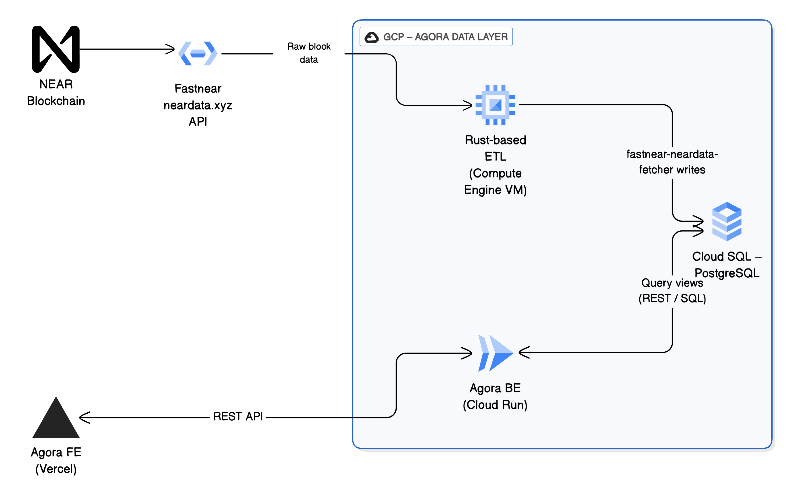

# NEAR Data Layer

## NEAR Blockchain Indexer

A Rust-based blockchain indexer for NEAR protocol that extracts veNEAR contract interactions and stores them in PostgreSQL.

### Architecture



### Prerequisites

- **Rust** (1.70 or higher) - Install from [rustup.rs](https://rustup.rs/)
- **PostgreSQL** (12 or higher)
- **Docker & Docker Compose** (for containerized setup)

### Quick Start

```bash
# Start with Docker
docker-compose up -d

# Or run locally
cargo run -- init    # Initialize database
cargo run -- start   # Start indexing
```

#### Docker Containers

The docker-compose setup builds two containers:

- **`postgres`**: PostgreSQL database (builds from `Dockerfile.postgres`)
- **`near-sink-sql`**: The indexer application (builds from main `Dockerfile`)

### Configuration

Edit `config.toml` for basic settings:

```toml
db_host = "localhost"
db_port = 5432
db_database = "near_indexer"
db_username = "postgres"
db_password = "password"
db_schema = "fastnear"

start_block = 183500000
batch_size = 10
num_threads = 64

# Important: Change this to trigger a backfill
app_version = "1.0.0"

venear_contracts = [
    "r-1745564650.testnet",
    "r-1746683627.testnet"
]
```

The indexer only processes transactions that interact with contracts listed in `venear_contracts`, filtering out all other blockchain activity.

#### Environment Variables

You can override any configuration setting using environment variables with the `INDEXER_` prefix. Create a `.env` file in the project root or set environment variables directly:

```bash
# .env file example
INDEXER_DB_HOST=production-db.example.com
INDEXER_DB_PASSWORD=secure_password
INDEXER_START_BLOCK=184000000
INDEXER_APP_VERSION=1.0.1
INDEXER_LOG_LEVEL=debug
```

Environment variables take precedence over `config.toml` values, making it easy to override settings for different deployments without modifying the configuration file.

### Block Tracking & Backfills

The indexer tracks its progress using a cursor system that stores the last processed block for each app version. This enables reliable resumption after restarts and controlled backfilling when needed.

#### How Progress Tracking Works

The `cursors` table maintains indexing state with:
- **id**: App version from configuration 
- **block_num**: Last successfully processed block height
- **block_id**: Hash of the last processed block

When starting, the indexer determines which block to begin from using this precedence:
1. **CLI argument**: `--start-block <number>` (highest priority)
2. **Database cursor**: Last processed block for the current app version
3. **Configuration file**: `start_block` value (fallback)

#### Normal Operations

During normal operations (deployments without logic changes, VM restarts), the indexer automatically resumes from its last cursor position. This ensures continuous processing without gaps or duplicate work.

#### Triggering Backfills

To reprocess historical data, you must manually increment the `app_version` in your configuration:

1. **Update version**: Change `app_version` in `config.toml` (e.g., "1.0.0" → "1.0.1")
2. **Set starting point**: Update `start_block` to your desired starting block
3. **Deploy**: Restart the indexer with the new configuration

The new app version creates a separate cursor entry, allowing the indexer to process from your specified starting block while preserving the original processing state.

### Source Files

- **`main.rs`**: Entry point, CLI argument parsing, command dispatch
- **`config.rs`**: Configuration loading from file and environment variables
- **`database.rs`**: PostgreSQL connection, table operations, cursor management
- **`indexer.rs`**: Main indexing logic, block fetching, starting block determination
- **`processor.rs`**: Receipt processing, data extraction, filtering veNEAR contracts

### Commands

- `cargo run -- init` - Initialize database by creating tables and views
- `cargo run -- start [--start-block <block>] [--num-threads <threads>]` - Start indexing

## SQL Views & Analytics

The indexer creates analytical SQL views for querying governance and veNEAR data. All views are located in the `sql_views/` directory.

### Available Views

- **`proposals`** - Comprehensive governance proposal data with voting metadata, approval status, and vote counts
- **`registered_voters`** - veNEAR token holders eligible to participate in governance voting
- **`proposal_voting_history`** - Individual vote records showing user voting patterns and choices
- **`user_activities`** - Summary of user interactions with veNEAR contracts and governance
- **`delegation_events`** - Vote delegation actions and delegate relationships
- **`approved_proposals`** - Proposals that have passed governance review and are eligible for public voting
- **`proposal_non_voters`** - Analysis of eligible voters who did not participate in specific proposals

### Helper Functions

The `helper_queries/` directory contains utility functions:

- **`safe_json_parse.sql`** - Parse JSON with error handling

### Usage Examples

```sql
-- Get all active proposals with vote counts
SELECT proposal_id, proposal_name, vote_count_for, vote_count_against 
FROM proposals 
WHERE proposal_status = 'Active';

-- Find top voters by participation
SELECT voter_account, COUNT(*) as votes_cast
FROM proposal_voting_history 
GROUP BY voter_account 
ORDER BY votes_cast DESC;

-- Check delegation relationships
SELECT delegator, delegate, delegation_timestamp
FROM delegation_events 
ORDER BY delegation_timestamp DESC;
```